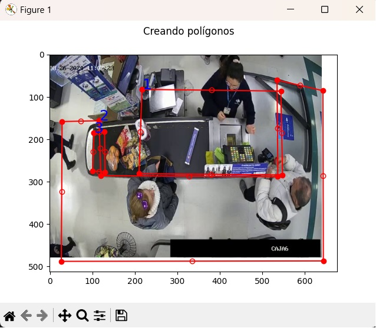

# poligon_creator

Correr:
```
python poligono_editor.py
```


# Ayuda para el Editor de Polígonos

El programa incluye una serie de comandos y acciones para interactuar con la imagen y los polígonos. A continuación se describen los comandos disponibles:

## Modo de Creación

- **Click izquierdo**: Crear nuevo vértice.
- **Click derecho**: Eliminar el último vértice del polígono actual.
- **Scroll up/ Scroll down**: hacer zoom in y zoom out.


## Modo de Corrección

- **Click izquierdo**: Mover el punto seleccionado.
- **Click derecho**: Eliminar el punto seleccionado.
- **Pasar sobre un punto intermedio**: Crea un nuevo vértice entre dos puntos.

## Comandos de Teclado

- **`c`**: Cargar polígonos desde un archivo `.txt`.
- **`n`**: Comenzar un nuevo polígono.
- **`i`**: Imprimir los polígonos en la consola y guardar en un archivo `.txt`.
- **`b`**: Borrar todos los puntos y polígonos.
- **`r`**: Cambiar al modo de corrección para mover o eliminar vértices.
- **`l`**: Cargar una nueva imagen.
- **`q`**: Salir del programa.
- **`h`**: Mostrar esta ayuda en la consola.

## Descripción de Funciones

- En **modo de creación**, puedes añadir y eliminar vértices para formar un polígono. Al acercar el último vértice al primero, el polígono se cerrará automáticamente.
- En **modo de corrección**, puedes seleccionar vértices para moverlos o eliminarlos. También puedes crear nuevos vértices entre los puntos existentes.

Para cambiar entre los modos de creación y corrección, presiona la tecla `r`.


